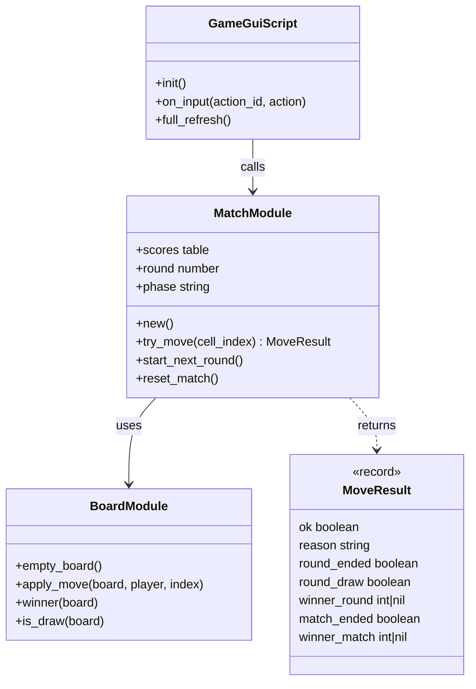
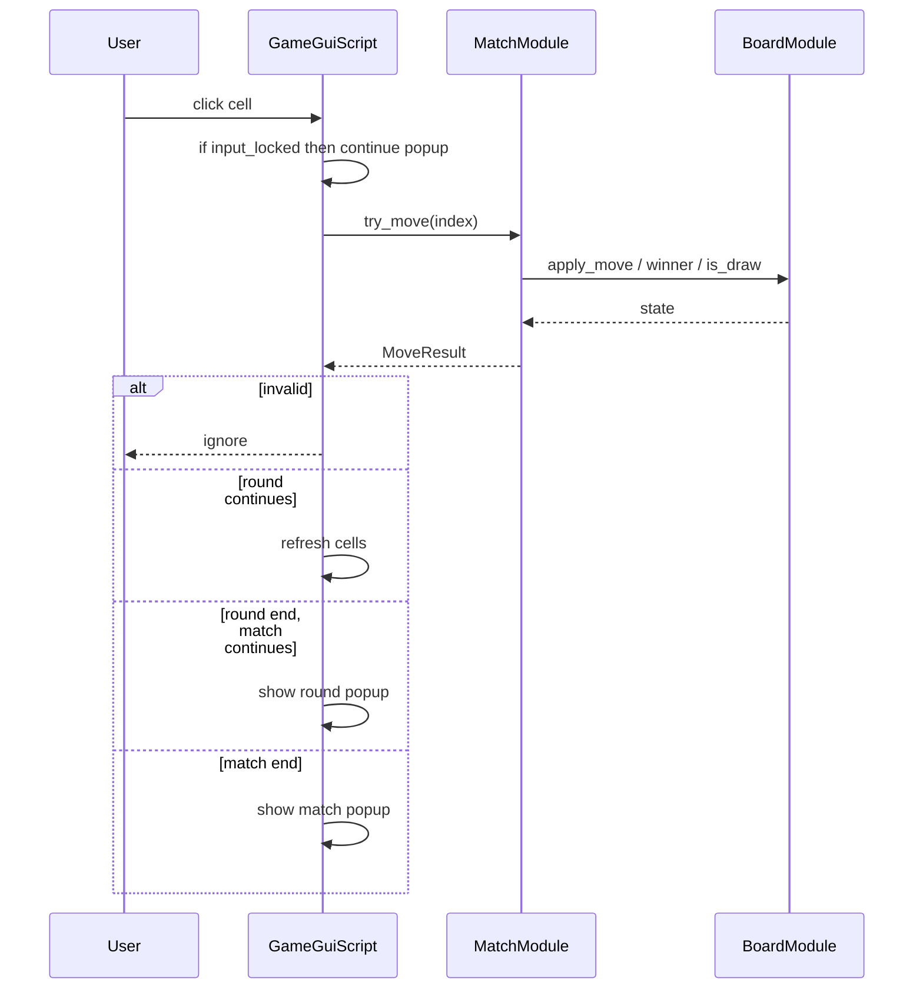
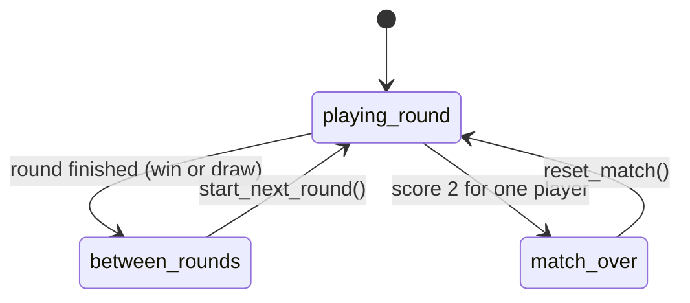

# UML (Mermaid)

Диаграммы можно просмотреть в GitHub, VS Code / Cursor с расширением Mermaid или на [mermaid.live](https://mermaid.live).

## Классы (логические роли)

## Последовательность хода

## Состояния матча

